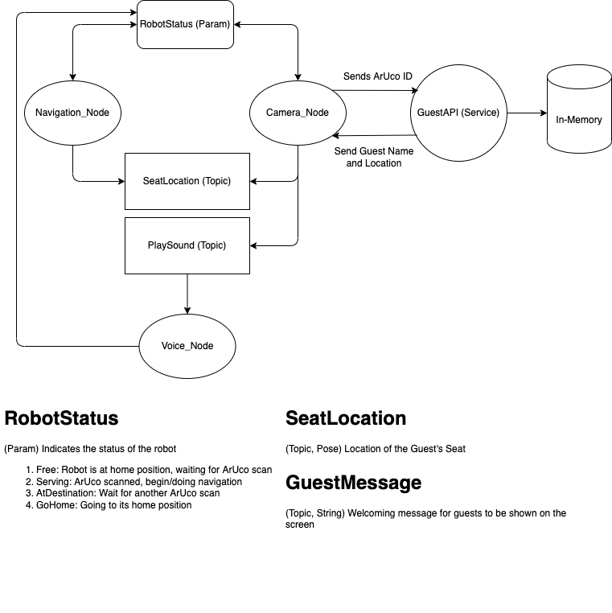

# CinemaBot

## 2147427 Advance Mobile Robot Final Project AY 1/2022

## Presentation Slides: [Link](https://docs.google.com/presentation/d/1_6hb4vhQVmdCeA4Zis3Di1N_dzU6yxaV0KGBH-UKo1g/edit?usp=sharing)
## Demo Video [Link](https://youtu.be/Fj0dbVLBTDs)

---

### System Architecture

### Running the program

Assuming the current directory is `CinemaBot`

#### TurtleBot (SSH)
1. ``make bringup``
2. ``make camera-node-init``

#### Remote PC

1.  ``make map-creation``
1.  ``make map-calibrate``
2.  ``make laptop-launch``
3.   `` make voice-node-init``

### Monitoring Robot Status

1. ``watch rosparam get RobotStatus``
